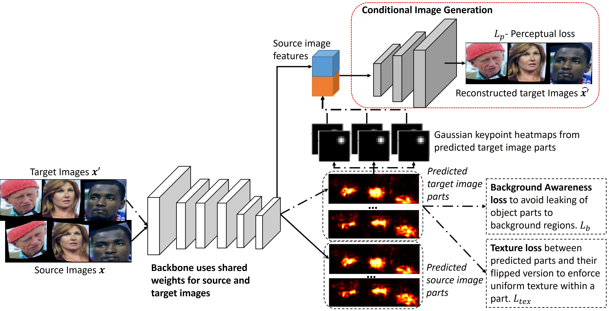

# SPASK
ECE271B project

PyTorch implementation for self-supervised part segmentation via keypoint constraints - Application to histopathology study in cancer detection.



## Installation

The code is developed based on Pytorch v1.8+ with TensorboardX as visualization tools. We recommend to use the same conda env as main branch to run the code:

Download Camelyon16 dataset

## Train the model

```$ CUDA_VISIBLE_DEVICES={GPU} python train.py -f exps/SPASK_LL_K2.json``` where `{GPU}` is the GPU device number.

## Processing the CAMELYON 16 dataset

You can find the code at [cam16_files]{https://github.com/DeepakSridhar/spask/tree/cam16/cam16_files} to:
* pre-process the WSIs into patches of required size and at required level using [patch_generation.py]{https://github.com/DeepakSridhar/spask/blob/cam16/cam16_files/patch_generation.py}
* run the model to make the test set predictions and evaluate the final predictions

## License

Apache 2.0 license
